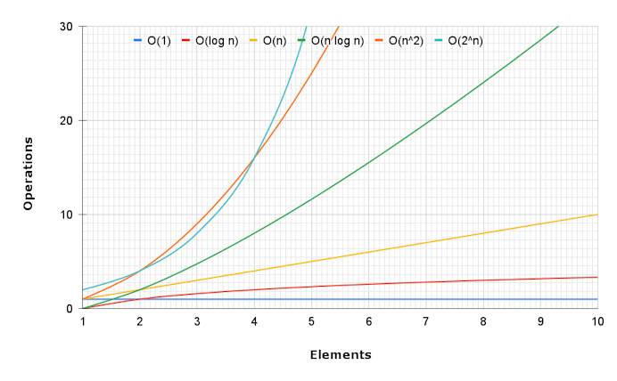

## Overview

Big O notation shows how an algorithm's speed or memory use grows as the input gets bigger.

- Time Complexity: Speed
  > How the amount of work changes as the input size increases.
- Space Complexity: Memory
  > How the amount of memory changes as the input size increases.

Measurements:

> - `O(1)`: Constant.
>   > The work stays the same no matter how big the input is.
> - `O(log n)`: Logarithmic.
>   > The work shrinks by a large factor each step, often by half.
> - `O(n)`: Linear.
>   > The work grows at the same rate as the input.
> - `O(n log n)`: Log Linear.
>   > The input is split into smaller parts that get handled in about `log n` stages with each stage doing `O(n)` work.
> - `O(n^2)`: Quadratic.
>   > The work grows with the square of the input size.
> - `O(2^n)`: Exponential.
>   > The work doubles with each extra input item.



## Rules

1.  Worst Case.
    > Big O describes the upper limit of how long an algorithm might take. It looks at the worst possible case so you know the running time will never be worse than that.
2.  Remove Constants.
    > Big O cares about how the work grows, not about fixed numbers. This means constants are removed. For example, `O(5n)` becomes `O(n)`.
3.  Different Inputs, Different Variables.

    > If an algorithm uses more than one input, each input should have its own variable so the complexity stays clear to accurately capture their separate impacts.

    > - Sequential loops:
    >   - Same inputs: `O(a + a)` -> `O(2a)` -> `O(n)`
    >     > ```js
    >     > func(a) {
    >     >    a.loop1 {}
    >     >    a.loop2 {}
    >     > }
    >     > ```
    >   - Different inputs: `O(a + b)`
    >     > ```js
    >     > func(a, b) {
    >     >     a.loop1 {}
    >     >     b.loop2 {}
    >     > }
    >     > ```
    > - Nested loops:
    >   - Same inputs: `O(a * a)` -> `O(a^2)`
    >     > ```js
    >     > func(a) {
    >     >     a.loop1 {
    >     >         a.loop2 {}
    >     >     }
    >     > }
    >     > ```
    >   - Different inputs: `O(a * b)`
    >     > ```js
    >     > func(a, b) {
    >     >    a.loop1 {
    >     >        b.loop2 {}
    >     >    }
    >     > }
    >     > ```

4.  Drop the Non-Dominant Terms.

    > Only the term that grows the fastest is kept. All smaller (non-dominant) terms are removed because they have much less effect as the input grows.

    > For example, `O(n) + O(n^2)` becomes `O(n^2)`.
    >
    > ```js
    > func(a) {
    >     a.loop1 {}
    >     a.loop2 {
    >         a.loop3 {}
    >     }
    > }
    > ```
