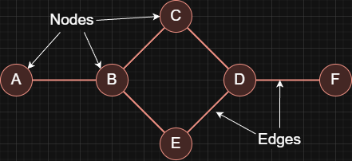
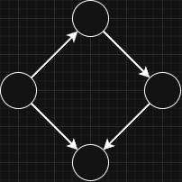
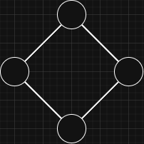
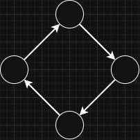
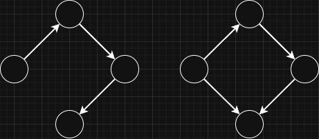
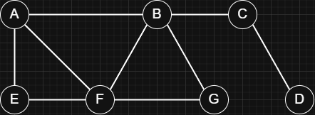
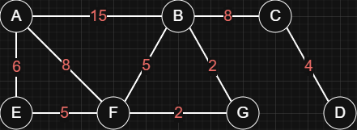

## Overview

A graph is a data structure used to represent relationships between things. It is made up of `nodes` (vertices) that represent the objects you care about
and `edges` that represent the connections between them.



### Types of Graphs

- Directed Graph:
  > Edges have a direction, so a connection goes from one node to another.
  > 
- Undirected Graph:
  > Edges have no direction, so the connection works both ways.
  > 
- Cyclic Graph:
  > Contains at least one cycle, meaning you can start at a node and return to it by following edges.
  > 
- Acyclic Graph:
  > Has no cycles, so you cannot return to a starting node by following edges.
  > 
- Unweighted Graph:
  > Edges do not have values, so all connections are treated as equal.
  > 
  > Here, the most efficient way from `A` to `D` is `ABCD` (the shortest path).
- Weighted Graph:
  > Edges have values (weights), such as distance, cost, or time.
  > 
  > Here, the most efficient way from `A` to `D` is `AFGBCD` (the lowest total cost).

### Code Representations

There are three common ways to represent a graph in code.

> Example graph:
> 

- Edge lists.

  > A graph is stored as a plain list of edges. Each edge is a pair (`from`, `to`) for unweighted graphs, or a triple (`from`, `to`, `weight`) for weighted graphs.

  ```js
  const edgeList = [
    ['A', 'B'],
    ['B', 'C'],
    ['B', 'E'],
    ['C', 'D'],
    ['D', 'E'],
    ['D', 'F'],
  ];
  ```

- Adjacency matrices.

  > A graph is stored as a 2D grid of values. The cell at (`i`, `j`) indicates whether there is an edge from node `i` to node `j` (often `0`/`1`), or stores the
  > edge weight in weighted graphs.

  ```js
  const adjMatrix = {
    A: { A: 0, B: 1, C: 0, D: 0, E: 0, F: 0 },
    B: { A: 1, B: 0, C: 1, D: 0, E: 1, F: 0 },
    C: { A: 0, B: 1, C: 0, D: 1, E: 0, F: 0 },
    D: { A: 0, B: 0, C: 1, D: 0, E: 1, F: 1 },
    E: { A: 0, B: 1, C: 0, D: 1, E: 0, F: 0 },
    F: { A: 0, B: 0, C: 0, D: 1, E: 0, F: 0 },
  };
  ```

- Adjacency lists.

  > A graph is stored as a mapping from each node to its neighbors. Each key is a node, and its value is a list of directly connected (outgoing) nodes
  > (or pairs like (`neighbor`, `weight`) for weighted graphs).

  ```js
  const adjList = {
    A: ['B'],
    B: ['A', 'C', 'E'],
    C: ['B', 'D'],
    D: ['C', 'E', 'F'],
    E: ['B', 'D'],
    F: ['D'],
  };
  ```
