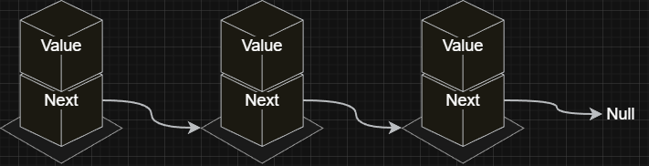
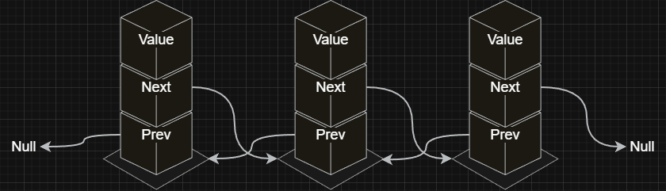

## Overview

A linked list is a data structure made of nodes where each node holds a value and a reference to the next node. The nodes form a chain in memory which allows the list to grow or shrink easily by adjusting references.

| Operations               | Complexity | Description                                             |
| ------------------------ | ---------- | ------------------------------------------------------- |
| Access/Edit              | O(n)       | Reaching a position requires sequential node traversal. |
| Access/Edit first & last | O(1)       | Head and tail pointers give direct access to ends.      |
| Insert                   | O(n)       | Traversal is required to reach the insertion point.     |
| Insert front & end       | O(1)       | Head or tail pointer is updated directly.               |
| Remove                   | O(n)       | Traversal is required to locate the node.               |
| Remove first             | O(1)       | Head pointer is updated directly.                       |

### Background

Linked lists can be formed with one or two references per node, creating singly or doubly linked structures.

- Singly Linked List:

  > - Value: The data stored in the node.
  > - Next: A reference to the next node in the list.
  >   

- Doubly Linked List:

  > - Value: The data stored in the node.
  > - Next: A reference to the next node in the list.
  > - Prev: A reference to the previous node in the list.
  >   

  > In doubly linked lists, removing the last node is `O(1)` because its previous node is directly reachable.

## Implementation

```js title="Singly Linked List" lineNumbers
class ListNode {
  constructor(value) {
    this.value = value;
    this.next = null;
  }
}

class LinkedList {
  constructor() {
    this.head = null;
    this.tail = null;
    this.size = 0;
  }

  // Access:
  get(index) {
    if (index < 0 || index >= this.size) {
      throw new Error('invalid index');
    }

    let currNode = this.head;
    for (let i = 0; i < index; i++) {
      currNode = currNode.next;
    }

    return currNode;
  }

  // Insert front:
  prepend(value) {
    const newNode = new ListNode(value);

    if (this.head === null) {
      this.head = newNode;
      this.tail = newNode;
    } else {
      newNode.next = this.head;
      this.head = newNode;
    }

    this.size++;
  }

  // Insert end:
  append(value) {
    const newNode = new ListNode(value);

    if (this.head === null) {
      this.head = newNode;
      this.tail = newNode;
    } else {
      this.tail.next = newNode;
      this.tail = newNode;
    }

    this.size++;
  }

  // Insert
  insertAt(index, value) {
    if (index <= 0) {
      this.prepend(value);
    } else if (index >= this.size) {
      this.append(value);
    } else {
      const newNode = new ListNode(value);

      const parent = this.get(index - 1);
      newNode.next = parent.next;
      parent.next = newNode;

      this.size++;
    }
  }

  // Remove:
  deleteAt(index) {
    if (this.head === null) {
      throw new Error('list is empty');
    }

    if (index < 0 || index >= this.size) {
      throw new Error('invalid index');
    }

    if (index === 0) {
      this.head = this.head.next;

      if (this.head === null) {
        this.tail = null;
      }
    } else {
      const parent = this.get(index - 1);
      parent.next = parent.next.next;

      if (index === this.size - 1) {
        this.tail = parent;
      }
    }

    this.size--;
  }

  // (optional) Only to make the list easier to view:
  toArray() {
    const list = [];

    let currNode = this.head;

    while (currNode !== null) {
      list.push(currNode.value);
      currNode = currNode.next;
    }

    return list;
  }
}
```

> Usage:
>
> ```js
> const myList = new LinkedList();
>
> myList.append('one');
> myList.append('two');
> myList.append('three');
> myList.insertAt(1, 'four');
> console.log(myList.toArray()); // (4) ['one', 'four', 'two', 'three']
> myList.prepend('five');
> myList.deleteAt(2);
> console.log(myList.toArray()); // (4) ['five', 'one', 'two', 'three']
> ```
