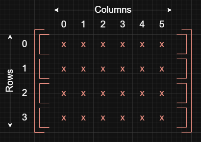

## Overview

A matrix in data structures usually means a 2D array: a grid of values arranged in rows and columns.



## Movements

| Action | Row  | Column |
| ------ | ---- | ------ |
| Up     | `-1` | `0`    |
| Down   | `+1` | `0`    |
| Left   | `0`  | `-1`   |
| Right  | `0`  | `+1`   |

> Example:
>
> Suppose we are at `Row 2`, `Col 3` and want to move two steps up.
>
> ```js
> [
>   [0, 0, 0, 0, 0, 0],
>   [0, 0, 0, 0, 0, 0],
>   [0, 0, 0, 1, 0, 0],
>   [0, 0, 0, 0, 0, 0],
> ];
> ```
>
> Apply the Up move `(-1, 0)` twice: subtract 1 from the row two times while keeping the column the same.
>
> ```js
> [
>   [0, 0, 0, 1, 0, 0],
>   [0, 0, 0, 0, 0, 0],
>   [0, 0, 0, 0, 0, 0],
>   [0, 0, 0, 0, 0, 0],
> ];
> ```
>
> The new position is `Row 0`, `Col 3`.
