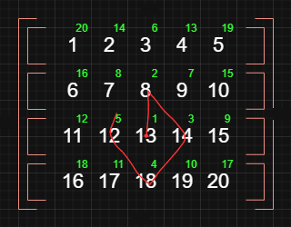

## Overview

Visits nodes level by level in a graph or tree, starting from the closest nodes to the start point.

| Time   | Space  |
| ------ | ------ |
| `O(n)` | `O(n)` |

## Tree BFS

> Example Tree:
>
> 

Implementation:

> Go to [Binary Search Tree](../trees/binary-search-tree.mdx) for the complete BST implementation.

> This implementation uses a [Queue](../queue.mdx) data structure, so you must implement it beforehand.

```js title="Binray Search Tree" lineNumbers
class BinarySearchTree {
  ...

  BFS() {
    if (this.root === null) return null;

    const list = [];
    const queue = new Queue();

    queue.enqueue(this.root);

    while (queue.size > 0) {
      const currNode = queue.peek();

      list.push(currNode.value);

      if (currNode.left) {
        queue.enqueue(currNode.left);
      }

      if (currNode.right) {
        queue.enqueue(currNode.right);
      }

      queue.dequeue();
    }

    return list;
  }
}
```

> Usage:
>
> ```js
> const tree = new BinarySearchTree();
>
> ...
>
> console.log(tree.BFS()); // [60, 59, 77, 28, 60, 125, 23, 28, 76, 35]
> ```

## Graph BFS

> Example Graph:
>
> 

### Adjacency Matrix

Implementation:

> This implementation uses a [Queue](../queue.mdx) data structure, so you must implement it beforehand.

```js title="Graph BFS (adjacency matrix)" lineNumbers
const adjacencyMatrix = {
  A: { A: 0, B: 1, C: 0, D: 0, E: 0, F: 0 },
  B: { A: 1, B: 0, C: 1, D: 0, E: 1, F: 0 },
  C: { A: 0, B: 1, C: 0, D: 1, E: 0, F: 0 },
  D: { A: 0, B: 0, C: 1, D: 0, E: 1, F: 1 },
  E: { A: 0, B: 1, C: 0, D: 1, E: 0, F: 0 },
  F: { A: 0, B: 0, C: 0, D: 1, E: 0, F: 0 },
};

function adjMatrixBFS(start, graph) {
  const seen = {};
  const queue = new Queue();

  queue.enqueue(start);

  const values = [];

  while (queue.size > 0) {
    const node = queue.dequeue();

    if (seen[node]) continue;

    values.push(node);
    seen[node] = true;

    const connections = graph[node];
    for (const key in connections) {
      if (connections[key] > 0 && !seen[key]) {
        queue.enqueue(key);
      }
    }
  }

  return values;
}
```

> Usage:
>
> ```js
> console.log(adjMatrixBFS('C', adjacencyMatrix)); // ['C', 'B', 'D', 'A', 'E', 'F']
> console.log(adjMatrixBFS('A', adjacencyMatrix)); // ['A', 'B', 'C', 'E', 'D', 'F']
> console.log(adjMatrixBFS('B', adjacencyMatrix)); // ['B', 'A', 'C', 'E', 'D', 'F']
> ```

### Adjacency List

Implementation:

> This implementation uses a [Queue](../queue.mdx) data structure, so you must implement it beforehand.

```js title="Graph BFS (adjacency list)" lineNumbers
const adjList = {
  A: ['B'],
  B: ['A', 'C', 'E'],
  C: ['B', 'D'],
  D: ['C', 'E', 'F'],
  E: ['B', 'D'],
  F: ['D'],
};

function adjListBFS(start, graph) {
  const seen = {};
  const queue = new Queue();

  queue.enqueue(start);

  const values = [];

  while (queue.size > 0) {
    const node = queue.dequeue();

    if (seen[node]) continue;

    values.push(node);
    seen[node] = true;

    const connections = graph[node];
    for (const key of connections) {
      if (!seen[key]) {
        queue.enqueue(key);
      }
    }
  }

  return values;
}
```

> Usage:
>
> ```js
> console.log(adjListBFS('C', adjList)); // ['C', 'B', 'D', 'A', 'E', 'F']
> console.log(adjListBFS('A', adjList)); // ['A', 'B', 'C', 'E', 'D', 'F']
> console.log(adjListBFS('B', adjList)); // ['B', 'A', 'C', 'E', 'D', 'F']
> ```

## Matrix (2D Array) BFS

> Example 2D Array:
> 
>
> > The red line shows the search flow starting from points `row: 2` and `col: 2` (green numbers show the same in a simpler format).

Implementation:

> This implementation uses a [Queue](../queue.mdx) data structure, so you must implement it beforehand.

```js title="Matrix BFS" lineNumbers
const arr2d = [
  [1, 2, 3, 4, 5],
  [6, 7, 8, 9, 10],
  [11, 12, 13, 14, 15],
  [16, 17, 18, 19, 20],
];

const directions = [
  [-1, 0], // up
  [0, 1], // right
  [1, 0], // down
  [0, -1], // left
];

function matrixBFS(matrix, row, col) {
  const seen = new Set();
  const queue = new Queue();

  queue.enqueue([row, col]);

  const values = [];

  while (queue.size > 0) {
    const [row, col] = queue.dequeue();

    if (row < 0 || row >= matrix.length || col < 0 || col >= matrix[0].length || seen.has(`${row}${col}`)) {
      continue;
    }

    seen.add(`${row}${col}`);
    values.push(matrix[row][col]);

    for (let i = 0; i < directions.length; i++) {
      const currDir = directions[i];
      queue.enqueue([row + currDir[0], col + currDir[1]]);
    }
  }

  return values;
}
```

> Usage:
>
> ```js
> console.log(matrixBFS(arr2d, 2, 2)); // [13, 8, 14, 18, 12, 3, 9, 7, 15, 19, 17, 11, 4, 2, 10, 6, 20, 16, 5, 1]
> console.log(matrixBFS(arr2d, 0, 0)); // [1, 2, 6, 3, 7, 11, 4, 8, 12, 16, 5, 9, 13, 17, 10, 14, 18, 15, 19, 20]
> console.log(matrixBFS(arr2d, 1, 0)); // [6, 1, 7, 11, 2, 8, 12, 16, 3, 9, 13, 17, 4, 10, 14, 18, 5, 15, 19, 20]
> console.log(matrixBFS(arr2d, 2, 3)); // [14, 9, 15, 19, 13, 4, 10, 8, 20, 18, 12, 5, 3, 7, 17, 11, 2, 6, 16, 1]
> ```
