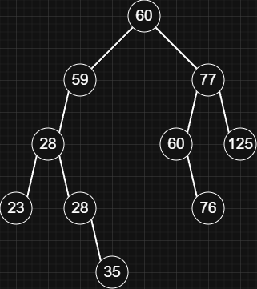
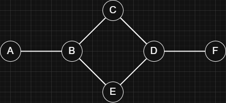
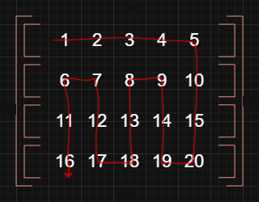

## Overview

Explores one path fully in a graph or tree before returning to try other paths.

| Time   | Space  |
| ------ | ------ |
| `O(n)` | `O(h)` |

## Tree DFS

> Example Tree:
>
> 

Order of searching:

> - Pre-order: `Node -> Left -> Right`.
>   > [60, 59, 28, 23, 28, 35, 77, 60, 76, 125]
> - In-order: `Left -> Node -> Right`.
>   > [23, 28, 28, 35, 59, 60, 60, 76, 77, 125]
> - Post-order: `Left -> Right -> Node`.
>   > [23, 35, 28, 28, 59, 76, 60, 125, 77, 60]
>
> The order of visiting children can be changed, such as visiting the right child before the left. To do this, simply swap the code for the left and right child traversals (use right before left) in the implementation below.

Implementation:

> Go to [Binary Search Tree](../trees/binary-search-tree) for the complete BST implementation.

```js title="Binray Search Tree" lineNumbers
class BinarySearchTree {
  ...

  preOrderDFS() { ... } // [!code highlight]
  inOrderDFS() { ... } // [!code highlight]
  postOrderDFS() { ... } // [!code highlight]
}
```

> Usage:
>
> ```js
> const tree = new BinarySearchTree();
>
> ...
>
> console.log(tree.preOrderDFS()); // [60, 59, 28, 23, 28, 35, 77, 60, 76, 125]
> console.log(tree.inOrderDFS()); // [23, 28, 28, 35, 59, 60, 60, 76, 77, 125]
> console.log(tree.postOrderDFS()); // [23, 35, 28, 28, 59, 76, 60, 125, 77, 60]
> ```

- Pre-order:

  ```js
  preOrderDFS() {
    const traversePreOrder = (node, list) => {
      if (node === null) return null;

      // node:
      list.push(node.value);

      // left:
      if (node.left) {
        traversePreOrder(node.left, list);
      }

      // right:
      if (node.right) {
        traversePreOrder(node.right, list);
      }

      return list;
    }

    return traversePreOrder(this.root, []);
  }
  ```

- In-order:

  ```js
  inOrderDFS() {
    const traverseInOrder = (node, list) => {
      if (node === null) return null;

      // left:
      if (node.left) {
        traverseInOrder(node.left, list);
      }

      // node:
      list.push(node.value);

      // right:
      if (node.right) {
        traverseInOrder(node.right, list);
      }

      return list;
    }

    return traverseInOrder(this.root, []);
  }
  ```

- Post-order:

  ```js
  postOrderDFS() {
    const traversePostOrder = (node, list) => {
      if (node === null) return null;

      // left:
      if (node.left) {
        traversePostOrder(node.left, list);
      }

      // right:
      if (node.right) {
        traversePostOrder(node.right, list);
      }

      // node:
      list.push(node.value);

      return list;
    };

    return traversePostOrder(this.root, []);
  }
  ```

## Graph DFS

> Example Graph:
>
> 

### Adjacency Matrix

Implementation:

```js title="Graph DFS (adjacency matrix)" lineNumbers
const adjMatrix = {
  A: { A: 0, B: 1, C: 0, D: 0, E: 0, F: 0 },
  B: { A: 1, B: 0, C: 1, D: 0, E: 1, F: 0 },
  C: { A: 0, B: 1, C: 0, D: 1, E: 0, F: 0 },
  D: { A: 0, B: 0, C: 1, D: 0, E: 1, F: 1 },
  E: { A: 0, B: 1, C: 0, D: 1, E: 0, F: 0 },
  F: { A: 0, B: 0, C: 0, D: 1, E: 0, F: 0 },
};

function adjMatrixDFS(node, graph, values, seen) {
  values.push(node);

  seen[node] = true;

  const connections = graph[node];

  for (const key in connections) {
    if (connections[key] > 0 && !seen[key]) {
      adjMatrixDFS(key, graph, values, seen);
    }
  }

  return values;
}
```

> Usage:
>
> ```js
> console.log(adjMatrixDFS('C', adjMatrix, [], {})); // ['C', 'B', 'A', 'E', 'D', 'F']
> console.log(adjMatrixDFS('A', adjMatrix, [], {})); // ['A', 'B', 'C', 'D', 'E', 'F']
> console.log(adjMatrixDFS('B', adjMatrix, [], {})); // ['B', 'A', 'C', 'D', 'E', 'F']
> ```

### Adjacency List

Implementation:

```js title="Graph DFS (adjacency list)" lineNumbers
const adjList = {
  A: ['B'],
  B: ['A', 'C', 'E'],
  C: ['B', 'D'],
  D: ['C', 'E', 'F'],
  E: ['B', 'D'],
  F: ['D'],
};

function adjListDFS(node, graph, values, seen) {
  values.push(node);

  seen[node] = true;

  const connections = graph[node];

  for (let i = 0; i < connections.length; i++) {
    const key = connections[i];

    if (!seen[key]) {
      adjListDFS(key, graph, values, seen);
    }
  }

  return values;
}
```

> Usage:
>
> ```js
> console.log(adjListDFS('C', adjList, [], {})); // ['C', 'B', 'A', 'E', 'D', 'F']
> console.log(adjListDFS('A', adjList, [], {})); // ['A', 'B', 'C', 'D', 'E', 'F']
> console.log(adjListDFS('B', adjList, [], {})); // ['B', 'A', 'C', 'D', 'E', 'F']
> ```

## Matrix (2D Array) DFS

> Example 2D Array:
> 
>
> > The red line shows the search flow starting from points `row: 0` and `col: 0`.

Implementation:

```js title="Matrix DFS" lineNumbers
const arr2d = [
  [1, 2, 3, 4, 5],
  [6, 7, 8, 9, 10],
  [11, 12, 13, 14, 15],
  [16, 17, 18, 19, 20],
];

const directions = [
  [-1, 0], // up
  [0, 1], // right
  [1, 0], // down
  [0, -1], // left
];

function matrixDFS(matrix, row, col, seen, values) {
  if (row < 0 || col < 0 || row >= matrix.length || col >= matrix[0].length || seen.has(`${row}${col}`)) {
    return;
  }

  values.push(matrix[row][col]);

  seen.add(`${row}${col}`);

  for (let i = 0; i < directions.length; i++) {
    const currDir = directions[i];
    matrixDFS(matrix, row + currDir[0], col + currDir[1], seen, values);
  }

  return values;
}
```

> Usage:
>
> ```js
> console.log(matrixDFS(arr2d, 0, 0, new Set(), [])); // [1, 2, 3, 4, 5, 10, 15, 20, 19, 14, 9, 8, 13, 18, 17, 12, 7, 6, 11, 16]
> console.log(matrixDFS(arr2d, 1, 0, new Set(), [])); // [6, 1, 2, 3, 4, 5, 10, 15, 20, 19, 14, 9, 8, 13, 18, 17, 12, 7, 11, 16]
> console.log(matrixDFS(arr2d, 2, 3, new Set(), [])); // [14, 9, 4, 5, 10, 15, 20, 19, 18, 13, 8, 3, 2, 7, 12, 17, 16, 11, 6, 1]
> ```
