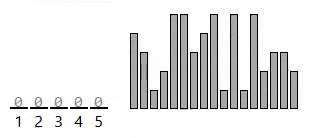

| Stable? | Time       | Space  |
| ------- | ---------- | ------ |
| Yes     | `O(n + k)` | `O(k)` |

Explanation:

> Find the largest value, then make a "count" list big enough to cover that range. Go through the original list and count how many times each value appears (add 1 to the count for each value you see). Then rebuild the sorted list by walking through the count list from smallest to largest and writing each value back the number of times it was counted.
>
> 

> - Non-negative Integers: Counting sort uses each value as an index in the count list, so the array based version only works with non-negative integers.
> - Small Key Range: It's better if the largest value isn't too big, since the count list needs one slot for every value up to that maximum. Even if there aren't many items to sort, a huge maximum means you still have to make a massive count list.

Implementation:

```js title="Counting Sort" lineNumbers
function countingSort(arr) {
  const max = Math.max(...arr);
  const count = new Array(max + 1).fill(0);

  for (let i = 0; i < arr.length; i++) {
    const number = arr[i];
    count[number]++;
  }

  let cursor = 0;
  for (let i = 0; i < count.length; i++) {
    for (let j = 0; j < count[i]; j++) {
      arr[cursor] = i;
      cursor++;
    }
  }
}

const numbers = [4, 3, 1, 2, 5, 5, 3, 4, 5, 1, 5, 1, 5, 2, 3, 3, 2];

countingSort(numbers);

console.log(numbers); // [1, 1, 1, 2, 2, 2, 3, 3, 3, 3, 4, 4, 5, 5, 5, 5, 5]
```
