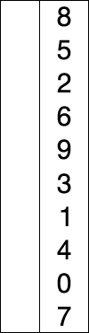

| Stable? | Time     | Space  |
| ------- | -------- | ------ |
| No      | `O(n^2)` | `O(1)` |

> Move from left to right through the list. For each position, scan the remaining unsorted part to find the smallest element, then swap it into the current position. Repeat until the unsorted part is empty.
>
> 

```js title="Selection Sort" lineNumbers
function selectionSort(arr) {
  for (let i = 0; i < arr.length; i++) {
    let min = i;

    for (let j = i + 1; j < arr.length; j++) {
      if (arr[j] < arr[min]) {
        min = j;
      }
    }

    [arr[i], arr[min]] = [arr[min], arr[i]];
  }
}

const numbers = [8, 5, 2, 6, 9, 3, 1, 4, 0, 7];

selectionSort(numbers);

console.log(numbers); // [0, 1, 2, 3, 4, 5, 6, 7, 8, 9]
```
