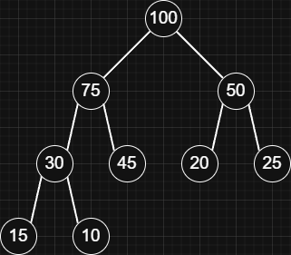

## Overview

A binary heap is a tree-shaped data structure, usually stored in an array, that keeps elements arranged so the highest-priority item is always at the root.

| Operations | Complexity | Description                                               |
| ---------- | ---------- | --------------------------------------------------------- |
| Peek       | O(1)       | The top element is always at the root.                    |
| Insert     | O(log n)   | The tree needs to be adjusted to keep the heap structure. |
| Remove Top | O(log n)   | The tree needs to be adjusted to keep the heap structure. |

### Structure

Binary heaps are complete binary trees, meaning they stay compact by filling levels from left to right.

- Min-heap:
  > Every parent is smaller than or equal to its children, so the minimum value is at the top.
  >
  > `[10, 15, 20, 30, 45, 50, 25, 75, 100]`
  > 
- Max-heap:
  > Every parent is greater than or equal to its children, so the maximum value is at the top.
  >
  > `[100, 75, 50, 30, 45, 20, 25, 15, 10]`
  > 

### Relationships

In an array-based heap, parent and child positions are found using simple index formulas.

> Example heap: `[100, 75, 50, 30, 45, 20, 25, 15, 10]`

- Parent index:
  ```js
  const parentIdx = Math.floor((i - 1) / 2);
  ```
  > The parent index of `45` (at index 4) is `Math.floor((4 - 1) / 2)` = `Math.floor(1.5)` = `1`, which is `75`.
- Left child index:
  ```js
  const leftChildIdx = i * 2 + 1;
  ```
  > The left child index of 75 (at index 1) is `1 * 2 + 1` = `3`, which is `30`.
- Right child index:
  ```js
  const rightChildIdx = i * 2 + 2;
  ```
  > The right child index of 75 (at index 1) is `1 * 2 + 2` = `4`, which is `45`.

## Implementation

```js title="Binary Heap (PriorityQueue)" lineNumbers
class PriorityQueue {
  constructor(compare) {
    this.compare = compare;
    this.heap = [];
  }

  peek() {
    return this.heap[0];
  }

  insert(value) { ... } // [!code highlight]

  remove() { ... } // [!code highlight]

  #getParentIdx(i) {
    return Math.floor((i - 1) / 2);
  }

  #getLeftChildIdx(i) {
    return i * 2 + 1;
  }

  #getRightChildIdx(i) {
    return i * 2 + 2;
  }

  #swap(i, j) {
    [this.heap[i], this.heap[j]] = [this.heap[j], this.heap[i]];
  }

  #percolateUp(i) {
    while (i > 0) {
      const parentIdx = this.#getParentIdx(i);

      if (this.compare(this.heap[i], this.heap[parentIdx]) >= 0) {
        break;
      }

      this.#swap(i, parentIdx);
      i = parentIdx;
    }
  }

  #percolateDown(i) {
    const len = this.heap.length;

    while (true) {
      const leftIdx = this.#getLeftChildIdx(i);
      const rightIdx = this.#getRightChildIdx(i);
      let best = i;

      if (leftIdx < len && this.compare(this.heap[leftIdx], this.heap[best]) < 0) {
        best = leftIdx;
      }

      if (rightIdx < len && this.compare(this.heap[rightIdx], this.heap[best]) < 0) {
        best = rightIdx;
      }

      if (best === i) {
        break;
      }

      this.#swap(i, best);
      i = best;
    }
  }
}
```

> Usage:
>
> > The initial compare function decides what "higher priority" means, so it determines whether the heap behaves like a `min-heap` or a `max-heap`.
>
> ```js
> // Min-heap (numbers)
> const pq1 = new PriorityQueue((a, b) => a - b);
> pq1.insert(5);
> pq1.insert(2);
> pq1.insert(6);
> pq1.insert(10);
> console.log(pq1.remove()); // 2
> console.log(pq1.peek()); // 5
>
> // Max-heap (numbers)
> const pq2 = new PriorityQueue((a, b) => b - a);
> pq2.insert(5);
> pq2.insert(2);
> pq2.insert(6);
> pq2.insert(10);
> console.log(pq2.remove()); // 10
> console.log(pq2.peek()); // 6
>
> // Objects by field (min-heap)
> const tasks = new PriorityQueue((a, b) => a.priority - b.priority);
> tasks.insert({ id: 'a', priority: 10 });
> tasks.insert({ id: 'b', priority: 1 });
> console.log(tasks.remove()); // { id: "b", priority: 1 }
> ```

- Insert:

  > The insert method appends the new value to the end of the array, then percolates up from that last index.
  >
  > > Percolating up:
  > >
  > > Repeatedly compare the current value with its parent. If the current value has higher priority according to `compare` (meaning `compare(child, parent) < 0`), swap them.

  ```js
  insert(value) {
    this.heap.push(value);

    this.#percolateUp(this.heap.length - 1);
  }
  ```

- Remove:

  > The remove method first handles small cases. If the heap is empty, it returns `undefined`. If it has one item, it pops and returns it.
  >
  > Otherwise, it stores the top value (at index 0), replaces the root with the last element (using `pop()`), then percolates down from the root.
  >
  > > Percolating down:
  > >
  > > Repeatedly compare the current node with its children. Choose the child with higher priority according to `compare` (the one that should be closer to the top),
  > > and swap if that child should come before the current node. When done, return the stored top value.

  ```js
  remove() {
    const len = this.heap.length;

    if (len === 0) {
      return undefined;
    }

    if (len === 1) {
      return this.heap.pop();
    }

    const top = this.heap[0];
    this.heap[0] = this.heap.pop();

    this.#percolateDown(0);

    return top;
  }
  ```

- Heapify (Optional): Turn a random array into a Binary Heap.

  > It copies the array into the internal heap, then works bottom-up from the last parent to the root. At each parent index,
  > it percolates down to fix that subtree. Once it reaches index 0, the whole array satisfies the heap structure.
  >
  > Inserting items one by one takes `O(n log n)`, but heapify builds the heap in `O(n)`.

  ```js
  heapify(arr) {
    this.heap = arr.slice();

    const lastParentIdx = this.#getParentIdx(this.heap.length - 1);
    for (let i = lastParentIdx; i >= 0; i--) {
      this.#percolateDown(i);
    }
  }
  ```

  > Usage:
  >
  > ```js
  > const myArr = [6, 8, 3, 4, 5, 2, 0, 1, 7, 11, 18, 17, 16, 15, 14, 20, -1, -10, 30];
  >
  > // Min-heap:
  > const pq1 = new PriorityQueue((a, b) => a - b);
  > pq1.heapify(myArr);
  > console.log(pq1.peek()); // -10
  >
  > // Max-heap:
  > const pq2 = new PriorityQueue((a, b) => b - a);
  > pq2.heapify(myArr);
  > console.log(pq2.peek()); // 30
  > ```
