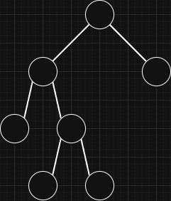
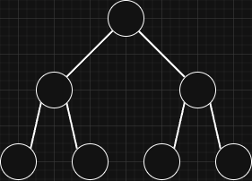
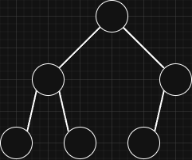
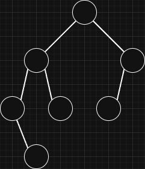

## Overview

A binary tree is a tree structure where each node can have up to two children, known as left and right children.
It is called a "binary" tree because the branching factor of each node is limited to two.

### Types of Binary Trees

- Full Binary Tree:
  > A full binary tree is a binary tree in which every node has either zero or two children.
  > 
- Perfect Binary Tree:
  > A perfect binary tree is a binary tree in which every level is completely filled and all leaf nodes are on the same level.
  > 
  >
  > - Node count in each level: `2^curr_level`
  > - Last level node count: `nodes_in_all_previous_levels + 1`
  > - Total node count: `2^(height + 1) - 1`
- Complete Binary Tree:
  > A complete binary tree is a binary tree in which all levels are filled except possibly the last level. The last level is filled from left to right.
  > 
- Balanced Binary Tree:
  > A balanced binary tree is a binary tree in which the heights of the left and right subtrees of any node differ by at most one.
  >
  > 
  >
  > The tree can become unbalanced depending on inserted and deleted items.
  > In an unbalanced tree, lookup, insert, and delete operations can take `O(h)` time because the tree starts to behave like a linked list.
  > To address the issue there are structures like
  > [AVL Trees ↗](https://medium.com/basecs/the-little-avl-tree-that-could-86a3cae410c7) or
  > [Red Black Trees ↗](https://medium.com/basecs/painting-nodes-black-with-red-black-trees-60eacb2be9a5).
  > These structures perform extra rotations after insert or delete operations to keep the tree balanced.
