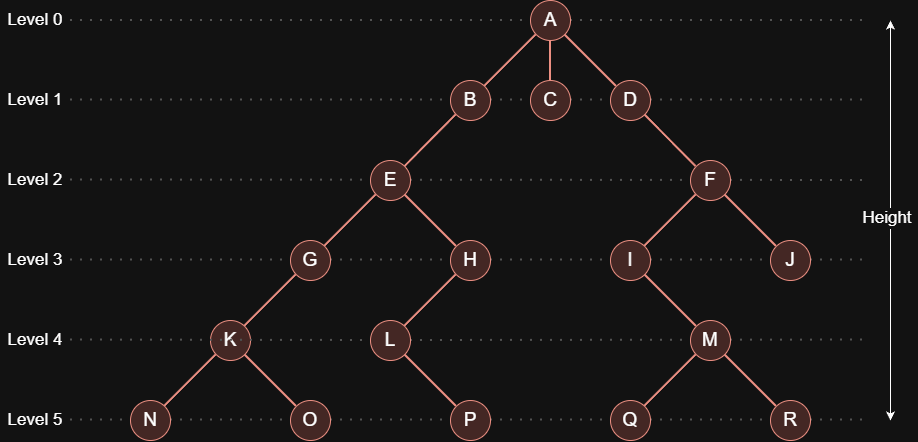

A tree is a hierarchical structure made of nodes that connect through parent and child links, starting from a single root at the top and spreading downward into branches.
Each node holds data and links to its children, and the structure never forms cycles, which keeps every path clear and direct.

> Terminology:
>
> - `Root`: The top node that starts the tree and has no parent.
> - `Parent`: A node that has one or more children. Each child has one parent.
> - `Child`: A node directly linked to a parent. A parent can have many children.
> - `Sibling`: Nodes that share the same parent and sit on the same level.
> - `Leaf`: A node with no children.
> - `Edge`: A link that connects two nodes.
> - `Path`: A sequence of nodes connected by edges.
> - `Depth`: The number of edges from the root to a node. The root has depth 0.
> - `Height`: The number of edges on the longest path from the root to a leaf.
> - `Subtree`: A smaller tree inside a larger one.
> - `Ancestor`: Any node on the path from a node to the root.
> - `Descendant`: Any node below a given node.
>   
