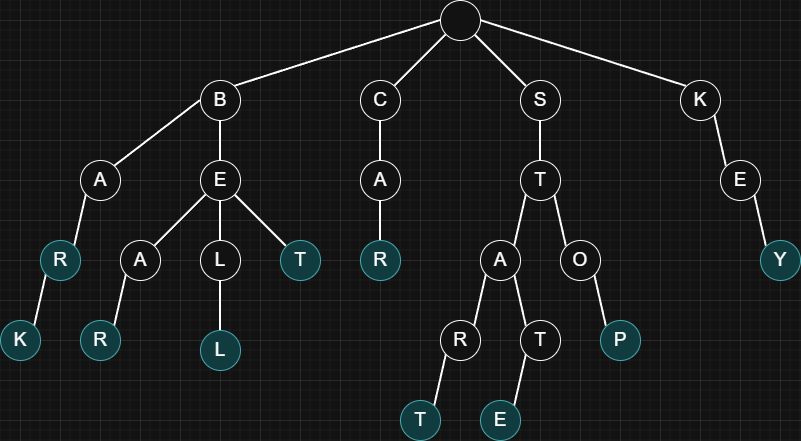

## Overview

A trie (prefix tree) is a tree-based data structure for storing and searching strings efficiently.
It organizes words by their characters so that strings with the same starting letters share the same path from the root.

> Use cases: Autocomplete, spell checking, dictionary or word lookup, IP routing, search suggestions.

| Operations           | Complexity       |
| -------------------- | ---------------- |
| Insert (word)        | O(word length)   |
| Search (word)        | O(word length)   |
| Starts With (prefix) | O(prefix length) |

> Trie example for the following words: `bar`, `bark`, `bear`, `bell`, `bet`, `car`, `start`, `state`, `stop`, `key`.
> 

## Implementation

```js title="Trie (Prefix Tree)" lineNumbers
class TrieNode {
  constructor() {
    this.children = new Map();
    this.isWord = false;
  }
}

class Trie {
  constructor() {
    this.root = new TrieNode();
  }

  insert(word) { ... } // [!code highlight]

  search(word) { ... } // [!code highlight]

  startsWith(prefix) { ... } // [!code highlight]

  #walk(str) {
    let node = this.root;
    for (const ch of str) {
      const next = node.children.get(ch);
      if (!next) return null;
      node = next;
    }
    return node;
  }
}
```

> Usage:
>
> ```js
> const trie = new Trie();
>
> trie.insert('stop');
> trie.insert('bark');
> trie.insert('bet');
> trie.insert('bar');
> trie.insert('car');
> trie.insert('bear');
> trie.insert('bell');
> trie.insert('start');
> trie.insert('key');
> trie.insert('state');
>
> console.log(trie.search('star')); // false
> console.log(trie.search('start')); // true
> console.log(trie.startsWith('st')); // true
> ```

- Insert:

  > The insert method starts at the root, then loops through the characters of the word.
  >
  > For each character, it checks if the current node already has that character in its `children`.
  > If it does not, it creates a new `TrieNode` and saves it under that character. Then it moves node to that child and keeps going.
  >
  > Once it has processed all characters of the word, it marks the last node with `isWord = true` so the trie knows a complete word ends there.

  ```js
  insert(word) {
    let node = this.root;

    for (const ch of word) {
      if (!node.children.has(ch)) {
        node.children.set(ch, new TrieNode());
      }

      node = node.children.get(ch);
    }

    node.isWord = true;
  }
  ```

- Search:

  > The search method starts from the root and follows the trie through the word's characters.
  > If at any point a character is missing, the search fails right away and returns `false`.
  >
  > If it successfully reaches the node for the last character, it still needs one more check: `isWord` must be `true`,
  > because the trie might contain the same path as a prefix without the full word being inserted.

  ```js
  search(word) {
    const node = this.#walk(word);
    return !!node && node.isWord;
  }
  ```

- Search Prefix:

  > Same as search, but it does not require `isWord` to be `true`, because a prefix does not need to be a complete word.

  ```js
  startsWith(prefix) {
    return !!this.#walk(prefix);
  }
  ```

- Suggestions (Optional): Get words that start with a given prefix.

  > First, it follows the trie using the prefix characters to reach the node where the prefix ends (if the prefix path does not exist, it returns `[]`).
  >
  > From that node, it explores all possible next letters below it using a recursive search.
  >
  > > Recursive search: It keeps going down one path, building a longer string `(path + ch)`. When it cannot go further, it backtracks and tries the next path.
  >
  > Whenever it reaches a node where `isWord` is `true`, it means the built string is a complete stored word, so it adds it to the results.
  >
  > The search also stops early once it has already found enough suggestions.

  ```js
  suggestions(prefix, limit = Infinity) {
    const start = this.#walk(prefix);

    if (!start) return [];

    const out = [];

    const dfs = (node, path) => {
      if (out.length >= limit) return;

      if (node.isWord) out.push(path);

      for (const [ch, child] of node.children) {
        dfs(child, path + ch);

        if (out.length >= limit) return;
      }
    };

    dfs(start, prefix);

    return out;
  }
  ```

  > Usage:
  >
  > ```js
  > console.log(trie.suggestions('st')); // ['start', 'state', 'stop']
  > ```
