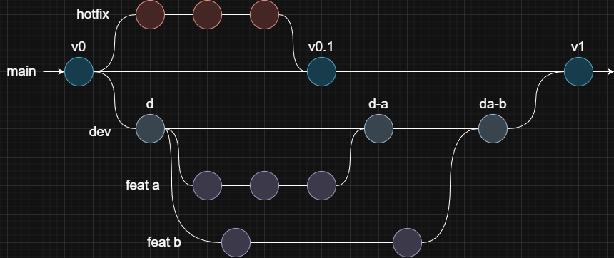
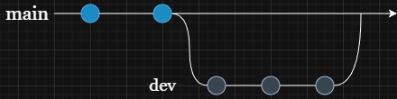
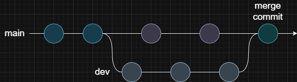

## Overview

A Git branch is an independent line of development within a repository. Branches allow you to isolate changes and work on them independently.

In a Git repository, there is a default branch (usually called `main` or `master`). Beyond that, you can create other branches to develop new features,
fix bugs, test ideas, or work on updates without affecting the main codebase.



What is a branch reference?

> A branch reference is a pointer in Git that refers to a specific commit.
>
> - It's a file named after the branch and stored in `.git/refs/heads/`.
> - The file contains the hash of the latest commit on that branch.
> - When you make a new commit, Git updates this file with the new commit hash.
> - Creating a new branch simply means creating a new file in `.git/refs/heads/`.
>   > You can even do this manually by creating a file and writing a commit hash inside it.
>   > The file name becomes the branch name, and it starts from the commit you specified.

What is `HEAD`?

> `HEAD` is a pointer in Git that represents your current position in the repository.
>
> - It's a file named `HEAD` in `.git/` that usually points to the branch reference of the current branch.
> - When you switch branches, Git updates `HEAD` to point to the new branch reference.

> - Attached HEAD:
>   > This is the normal state where `HEAD` points to a branch reference.
>   > Any new commits you make are added to that branch, and `HEAD` moves forward along with it.
> - Detached HEAD:
>   > This occurs when `HEAD` points directly to a specific commit hash instead of a branch reference.
>   > In this state, new commits aren't associated with any branch, and you might need to create a new branch to save your work.

> You can also use it instead of `<commit_hash>`:
>
> - `HEAD`: The current (latest) commit.
> - `HEAD~<n>`: The commit `n` steps before `HEAD` (e.g., `HEAD~2`).

## Core Branching Commands

- `git branch`: List all existing branches.

  > - `<name>` - Create a new branch based on the current `HEAD`.
  > - `<new_name> <commit_hash>` - Create a new branch from a specific commit.
  > - `-d <name>` - Delete a branch if it has already been merged.
  >
  >   > Use `-D` to force deletion even if it hasn't been merged.
  >
  >   > You cannot delete the branch you're currently on. Switch first.
  >
  > - `-M <new_name>` - Rename the branch you're on.
  >   > Use `-m <old_name> <new_name>` to rename a different branch.
  > - `-vv` - Show local branches with their remote tracking information.
  > - `-a` - List both local and remote branches.
  > - `-r` - List only remote-tracking branches.

- `git switch <name>`: Switch to the given branch.

  > - `-c` - Create and switch to a new branch.
  >   > Use `-C` to recreate a branch if it already exists.

  > Use `-` instead of a branch name to switch back to the previous branch.

  <Callout>

  When you switch branches, Git updates your project's file tree to match the state of that branch.

  If you try to switch while having uncommitted changes:
  - Without conflicts:
    Git will carry your changes to the new branch with you.
  - With conflicts:
    Git will block the branch switch. You'll need to commit, stash, or discard your changes before switching.

  </Callout>

## Merging Branches

Merging in Git is the process of combining changes from one branch into another. The changes from the source branch are integrated into the target branch.

- `git merge <Name>`: Merge changes from the specified branch into the current branch.

  > - `--squash` - Combine all commits from the merged branch into the staging area of the current branch.
  >   > Allows committing all changes as a single commit to keep history clean.

  > If you encounter conflicts or issues during a merge, you can use `git merge --abort` to cancel the process or resolve them.

### Fast-forward Merge

This type of merge occurs when no new commits have been made on the target branch since the source branch was created.

> In such cases, Git simply moves the target branch pointer forward to the latest commit on the source branch without creating a new merge commit. This results in a linear commit history.



- `git merge --no-ff <Name>`: Always create a merge commit even when a fast-forward is possible.

### Three-way Merge

This type of merge occurs when both branches have new commits.

> In such cases, Git compares the changes made in both branches relative to their common ancestor and tries to combine them automatically.
>
> If both branches modify the same lines, Git can't decide which version to keep. This is called a merge conflict. When conflicts occur, Git waits you to resolve them manually.



Resolving merge conflicts:

> 1. Git reports a merge conflict and shows which files are affected.
> 2. The conflicted files contain special markers showing differences between branches.
>    > ```
>    > <<<<<<< HEAD
>    > your content on current branch
>    > =======
>    > incoming content from the other branch
>    > >>>>>>> dev
>    > ```
> 3. Edit the files to decide which changes to keep.
>    > You can choose one version or combine parts of both.
> 4. Remove the conflict markers and save the files.
> 5. Stage the resolved files.
> 6. Create a commit to finish the merge.

## Cherry Picking

Cherry-picking in Git means taking specific commits from one branch and applying them to another branch without merging the entire branch.

- `git cherry-pick <commit_hash>...`: Apply the changes from a specific commit (from another branch) to the current branch.

<Callout type="warn">
  Cherry-picking creates new commits with different commit IDs. This can lead to duplicate commits if the process is not
  managed carefully and the branches are merged later.
</Callout>
