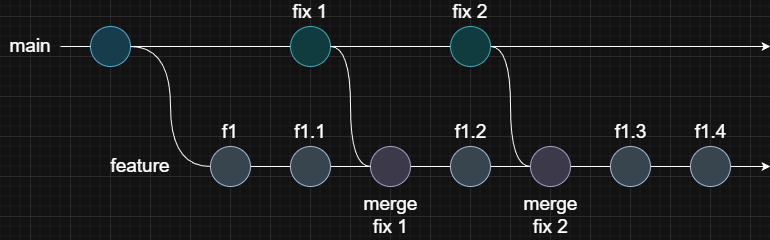
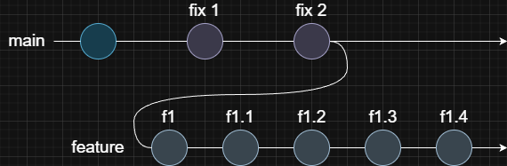

<Callout type="warn">
  Avoid using rebase on shared or public branches. It can cause conflicts and make collaboration harder since rebasing
  changes the commit history.
</Callout>

## Integrating Changes

What is it?

> Let's say you start working on a new feature by creating a `feature` branch.
> While you're developing, your teammates merge their completed work, such as bug fixes, into the `main` branch.
> To keep your `feature` branch up to date and avoid working with known issues, you need to bring those changes in.
>
> Yes, you can do this just by merging the `main` branch into your `feature` branch. That's it, but...

What is the problem?

> As you keep working, more bug fixes and updates might get merged into the `main` branch that you'll want to include again in your `feature` branch.
> You can keep merging to stay up to date, but imagine the `main` branch is very active and gets such updates several times a day.
> If your feature takes a while to finish, your branch history can quickly fill up with unnecessary merge commits that don't really say anything about the actual work you're doing.

The solution:

- `git rebase <branch_name>`: Reapply your current branch's commits on top of the specified branch (integrate its latest changes).
  > If conflicts appear, you can either resolve them or cancel the process with `git rebase --abort`.
  > When resolving conflicts, don't commit as usual. Instead, use `git rebase --continue` to move forward.

> Git rebasing solves the problem by reapplying your changes on top of another branch.
>
> It rebuilds your work on the source branch's latest version. It's like you just created the branch again, but this time you already have your changes in place.

## Interactive Rebase (History Editing)

Interactive rebase lets you modify a branch's commit history by editing, reordering, squashing, or removing commits.

- `git rebase -i <commit_hash>`: Initialize the interactive rebase process for the history that comes after the given commit.
  > Here is the full flow of the process:
  >
  > 1. Git opens the interactive editor showing a list of commits and their actions (the default action is `pick`).
  > 2. Choose an action for each commit.
  >
  >    > Choosing an action means changing the default action to something else.
  >
  >    > Some available actions:
  >    >
  >    > - `pick` - Use the commit as is.
  >    > - `reword` - Edit the commit message.
  >    > - `edit` - Modify the commit content.
  >    > - `squash` - Combine this commit with the previous one and edit the message.
  >    > - `fixup` - Combine with the previous commit but discard this message.
  >    > - `drop` - Remove the commit completely.
  >    > - You can also reorder commits by simply moving their lines up or down.
  >
  > 3. Save the file and close the editor.
  > 4. Handle the selected actions.
  >
  >    > Each action has its own process:
  >    >
  >    > - `reword` - Opens an editor to edit the commit message.
  >    > - `edit` - Pauses the rebase so you can modify (add/edit/delete) the content. After making changes, stage them and run `git rebase --continue`.
  >    > - `squash` - Opens an editor to make a merging message.
  >
  >    > If any conflicts occur, resolve them and continue with `git rebase --continue`, or cancel the process with `git rebase --abort`.
  >
  > 5. When you finish handling all the requested actions, you'll have a rewritten commit history.
